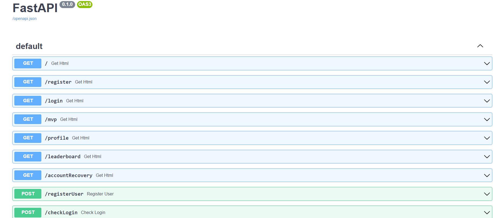
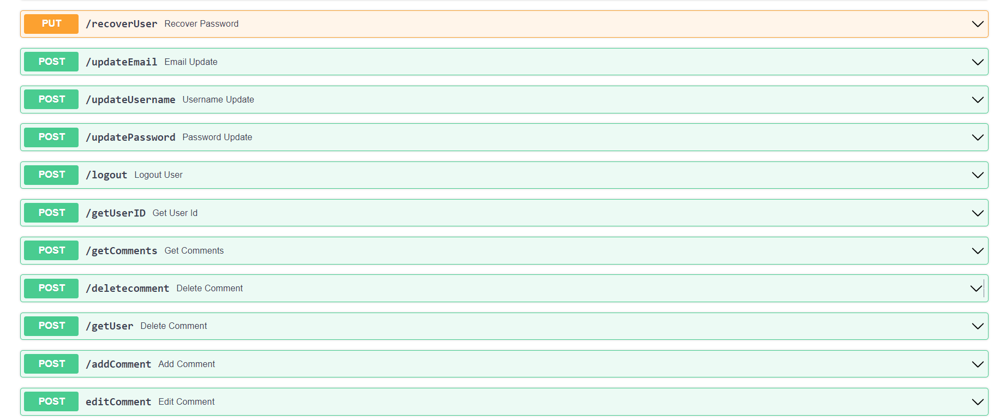
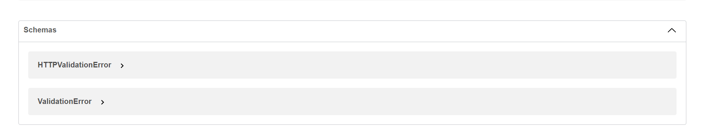
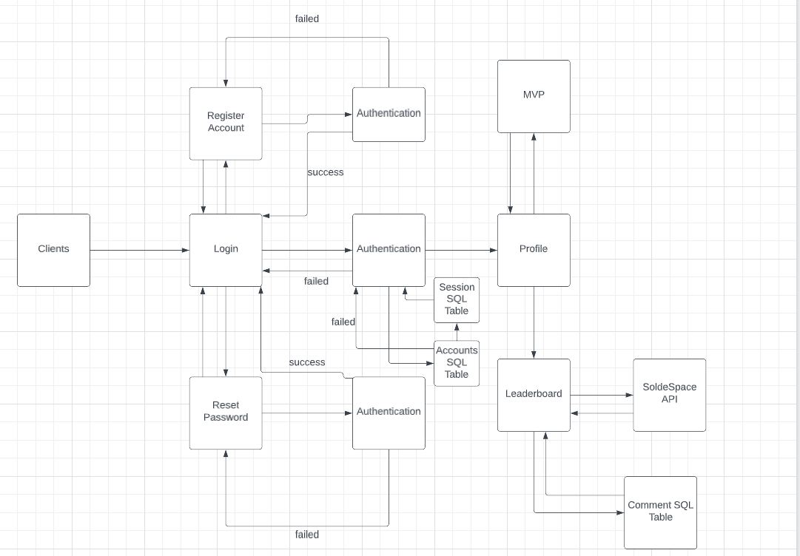
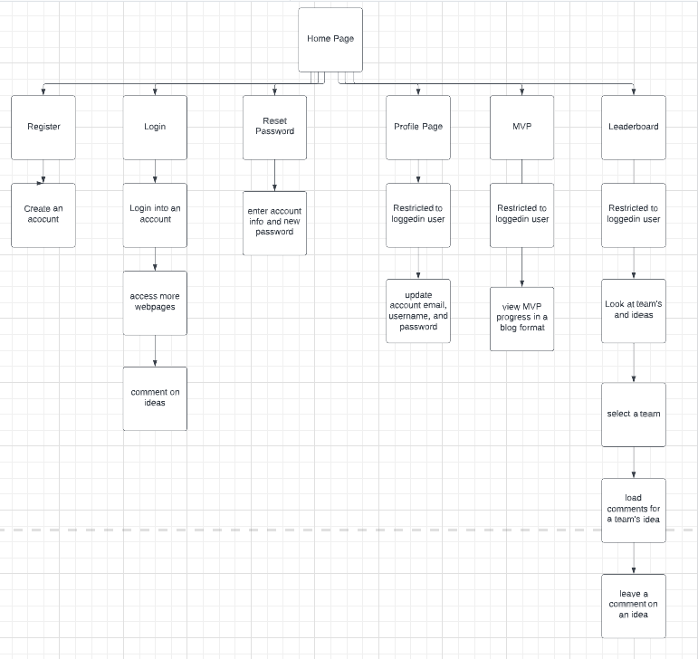
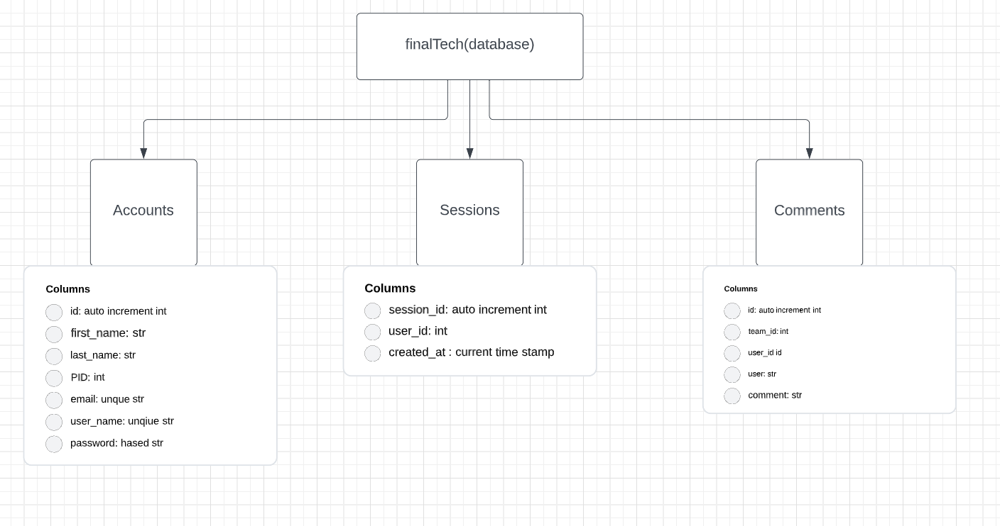

Matthew Jalbert A16523481

This README will keep track of my progress I have implemented week by week

## Week 1
* Created a SQL database and table of registered users that uses case-sensitive for rows (has a default admin account to automatically registered)
* Implemented a login page and RESTFUL API backend and javascript to check if the given username or email and password match an entry in the table(need to implement what to do after a successful login)
* Implemented a register page with RESTFUL API and javascript that will allow a user to register an account. A new registered account must have a unique username and email or else the registration fails. Checks that PID is only numbers and 8 chars long. After a successful register it redirects to the login page
* Implemented a forgot password page with RESTFUL API and javascript that will let a user reset their password for an account. This will check the SQL table for a matching entry and if valid update its password
* Implemented hashing of passwords in the table. Where a password entry in the table is hashed and will be decoded server side to check for valid login
* Made a nav bar with links between pages, submit and clear forms without needing to reload page, alerts for input validation into forms, incorrect login info, or when the server cant find an account to update a password for.
* Added the MVP page with work done in Lab 6/7. Added a link to all HTML pages for now until I implement a login system that keeps track if a user is logged in or not and display routes accordingly.
* Created a simple landing page that explains the purpose of the website and a call of action for a user to register an account. Also added an `About Me` section that introduces myself to the user
* Plans for next week is to implement sessions, adjust navigation bar based on session login, profile page, and get SlideSpace API to work

## Week 2
* Added a profile page that has forms to update email, username, password, and a logout button as well as the javascript to make it work and update the SQL table
* Added session SQL table and comment table
* Got sessions to work and can be used to update emails, passwords, and username. Has verification to make sure you only update your account info
* Updated login to redirect to profile page and upon logging in make a session associated with the user
* Added webpage login in verification(`verifyLogin.js` and `loginStopper.js`) and redirection if a session does not exist. Stops users from accessing login, registration, forgot password page if logged in. Also stops non-logged-in user from getting account specific pages
* Added dynamic navigation bar with `nav.js` where it checks the session id of the user then changes it to account locked webpages
* Added a logout feature in `nav.js` that will end the session, updates the session SQL table by calling the server backend, and redirect the user to the login in page
* Got SlideSpace API to load data, parse it, combine the scores into one total and sort the grid by it. Also added an on click listener for each idea to load the comments for it
*  Plans for next week is work on a comment system, MVP navigation skipper, and final touches

## Week 3 
* Got comments to load from SQL table, made them deletable by the `user_id` that made the comment
* Can add comments to an idea 
* Changed styling of website in `nav.css` and `lb.css`
* Added MVP page quick navigation

## Final Report

Challenges
* Create a user account
* Forgot user password
* Login
* Restrict webpages
* Create sessions
* Load team ideas
* Add comments to ideas
* Delete comments from ideas

With this final tech assignment we are challenged with making a website that allows a user to register an account and comment on ideas from the SlideSpace API provided.
For this challenge there is two parts to handle. The account creation and the user verification to restricted webpages.
Firstly, for account creation there is a SQL table for the registered accounts. When an account is registered it checks if the table holds the provided username or email and 
will not register the account if it finds it. A user also has the option to reset their password which will take all the account information and a new password. If the information
matches an entry in the data table then the account associated with the information will have its password updated in the SQL table. Also, a user can login; which will take a username
or email and password and check the SQL table to see if it is valid if it is. It will create a session and redirect to the profile page. To handle the sessions the database has a session
SQL table. When a session is started a new entry in the session table is created with the username, user_id, and time of log in. This session is used to verify a login and update the 
user to access restricted webpages, as well as update the nav bar. To let update the nav bar and to see if a person can access a webpage I work a script `userverify.js` which will 
check for an active session and will let a user enter a webpage and update the nav bar. If a user tries to access a restricted webpage when not logged in it will kick them out to the 
login page. Additionally, from stopping a logged-in user from going back to the login in page without signing out. There is a script that will redirect to the profile page if they try.
Up to this point this has been done with simple RESTFUL API calls and forms that collect information.
Secondly, there is now the leaderboard API. This was done by using the provided API calls that first got sections, then each team in a section, then the team data for each team, and finally
the team scores. This was done by using `async functions` and `promises`. Where for each consecutive API it waited for one to gather all the information then pass that onto the next API call.
Once all the team and score data was captured it was place as entries into a `div`. Where I added an `onClickListener` for each idea. Where once clicked it would load the comments for this idea.
To load comments I created a comments SQL table. This table keep track of the `team_id`, `user`, and `comment text`. When a user used the `textarea` and submitted the comment it would create
a comment entry and place it in the table. So in the future other user could see the comments of the selected ideas. To check if a user could delete comments it checked if the current signed-in
user matched that in the comment SQL table and would add an icon that would delete the comment in the table and from the webpage html. Then finally a user can logout which would delete the session
from the session table.

## REST Routes

## System Design

## Information Architecture

## Database Diagram

## Video
[Video Link](https://youtu.be/pXRsTDFaUS4)